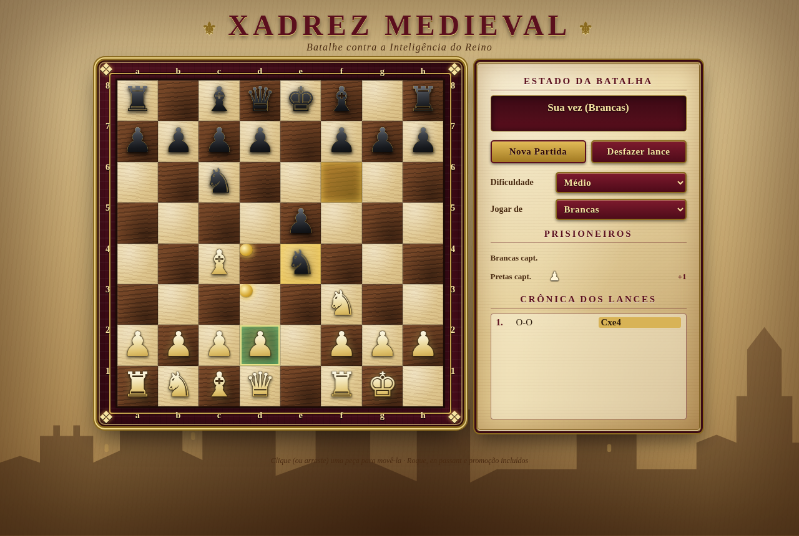

# ♞ Xadrez Medieval

Um jogo de xadrez com visual medieval para jogar contra a IA, direto no navegador. É um único arquivo HTML, sem dependências e sem instalação.



## Como jogar

Abra o arquivo `index.html` no navegador. Clique numa peça para ver os lances válidos e clique na casa de destino (ou arraste a peça). Você pode jogar de brancas ou de pretas.

## Recursos

- Três níveis de dificuldade: **Fácil**, **Médio** e **Difícil**.
- Regras completas: roque (pequeno e grande), en passant, promoção de peão, xeque, xeque-mate, afogamento, material insuficiente, regra dos 50 lances e tripla repetição.
- Lances ilegais que deixam o rei em xeque não são permitidos.
- Desfazer lance, nova partida, lista de lances em notação SAN e peças capturadas.
- IA própria (alfa-beta com quiescence e tabela de transposição) rodando em Web Worker.

## Estrutura

- `index.html`: o jogo final (gerado por `node build.js`).
- `src/engine.js`: motor de regras e IA.
- `src/template.html`: interface e estilos.
- `test/`: testes de perft, de regras e de simulação IA x IA.

Para reconstruir e testar (requer Node.js):

```bash
node build.js
node test/perft.test.js
node test/rules.test.js
node test/ai-sim.test.js
```

## Créditos

Criado por **Luis Felipe** ([@LiPeFernandez](https://github.com/LiPeFernandez)) com o desenvolvimento assistido pelo **Grok Bot**.
